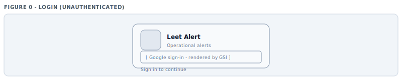
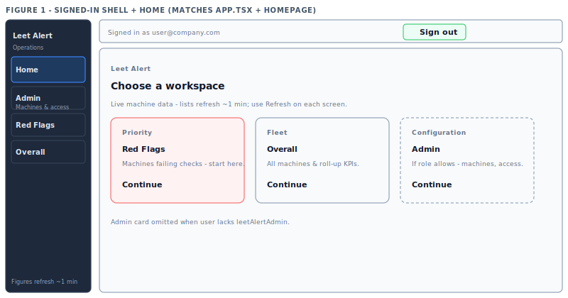
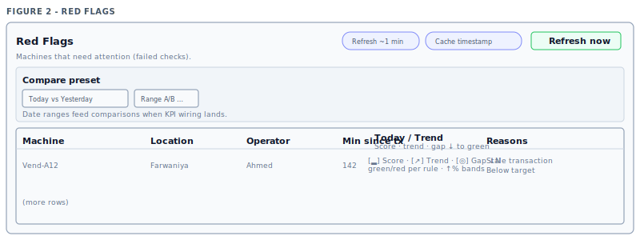
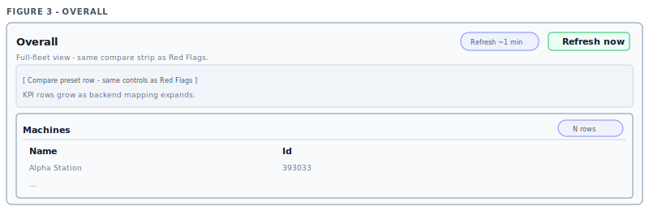
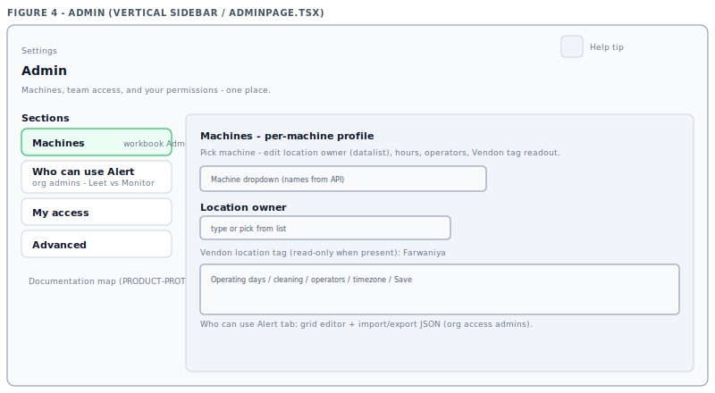

# Leet Alert — product scope (PM / PO)

**App:** [alert.theleetclub.com](https://alert.theleetclub.com) · **Repo:** `apps/alert-theleetclub-com/`  
**Refresh PDF:** `npm run doc:pdf` (commit md + `figures/wire-*.svg` + `PRODUCT-PROTOTYPE.pdf`).  
Shipped UI has no “prototype” wording — wireframes are documentation only.

---

## Routes & capabilities

| Route | Area | What users get |
|-------|------|----------------|
| `/` | Entry | Redirect to **Home**. |
| `/login` | Login | Google sign-in. |
| `/home` | Home | Cards: **Red Flags** → **Overall** → **Admin** (if role allows). |
| `/red-flags` | Red Flags | **Red Alert** snapshot; columns match `alert.theleetclub.com.xlsx` **Red Flags** row 1 (see `docs/alert-workbook-red-flags-tab.md`); trailing columns **—** until API wires workbook metrics; five **timespan presets**; ~1 min refresh. |
| `/overall` | Overall | Workbook **Overall** sheet columns (see `docs/alert-workbook-overall-tab.md`); Admin-derived Operating Hours + Operator + snapshot Last Transaction; other workbook metrics show **—** until API wiring; ~1 min refresh. |
| `/admin` | Admin | User-entered data **not on Vendon** (schedules, cleaning, access). **Machines** (profiles, Vendon readout), **Who can use Alert**, **My access**, **Advanced**. |

---

## Permissions (summary)

**people-api** rules (same store as Monitor): view → Red Flags + Overall; **leetAlertAdmin** → Admin and edit **Who can use Alert** (same session rules API as Monitor **admin**); optional Monitor grid in **Advanced**. Adding people is limited to your Google Workspace domain(s): env **`ACCESS_ALLOWED_EMAIL_DOMAINS`** / **`DASHBOARD_ACCESS_EMAIL_DOMAINS`**, else the signed-in admin’s domain. No entitlements → **No access** after sign-in until an admin grants access.

---

## Visual UI prototype (figures 0–4)

Aligned with current React shell (`App.tsx`), Home (“Choose a workspace”), and Admin vertical sections (`AdminPage.tsx`).

*Figure 0 — Login*

*Figure 1 — Sidebar **Operations**; nav Home · Admin · Red Flags · Overall; Home hero + cards (Priority / Fleet / Configuration).*

*Figure 2 — Toolbar, compare preset, table.*

*Figure 3 — Same compare pattern; fleet table.*

*Figure 4 — Settings header; **Sections** sidebar (Machines active); Machines tab — machine picker, location owner datalist, Vendon tag.*

**Composite SVG (all panels):** `docs/product-prototype/visual-prototype.svg`

---

## PO quick facts

- Lists refetch ~**1 min**; **Refresh now** on each screen.
- Admin order: **Machines → Who can use Alert → My access → Advanced** (team tab only if org admin).

---

## Changelog

| Date (UTC) | Summary |
|------------|---------|
| 2026-05-06 | **Red Flags:** **Call OP** / **Call AM** columns (Slack DM when `SLACK_*` ids configured; AM resolved from AM Plan location buckets; OP uses strike email → optional Slack user map, else mailto). Placeholder KPI columns show **?**. **Overall:** **?** + hover for disconnected metrics. **Admin:** catalog vs saved profile counts at top. |
| 2026-05-06 | **Red Flags board:** “Send Credit” → **Credits Sent** + new **Dispense Tests** (same criteria as Monitor drink tests). Trend cell updated to **3-box** layout (Score / Trend / Gap) with red/green semantics. **Overall:** Operating Hours now shows **hours only** (tag displayed separately) and Admin “Saved profiles” moved below the editor. |
| 2026-05-06 | **Fleet tags:** API adds `vendon_tag_source`; Admin explains **how the tag was derived** (feed field / group / name parse). **Removed** sidebar **Documentation map** + Red Flags **xlsx/docs** UI copy. **Machines / Advanced** tables: **bounded scroll**, sticky header, wrapped cells. Prior Admin machine-profile row editor + machine tag column behavior unchanged. |
| 2026-05-05 | **Admin → Location owner:** Vendon **`prose` / `callInCode`**, **split machine `name`** on `\| / –` for fleet codes; no **`/location`** names in tag datalist; API validates tags only; UI **does not prefill** legacy DB site text — hint when Vendon has no tag. |
| 2026-05-02 | **Who can use Alert** — org email domain allowlist (server + UI); **leetAlertAdmin** can save access rules. Red Alert / machine **location** text prefers Vendon **tags** and machine tag fields before the generic Vendon `location` string (aligns with Admin “location owner” / machine tag). |
| 2026-05-04 | **Red Flags** = **xlsx** column order (through **Tech Visit**); `alert.theleetclub.com.xlsx` in repo; `redFlagsWorkbookColumns.ts`; placeholders for columns not in snapshot; machine / alert split; **Admin** tag/priority (other row). |
| 2026-05-02 | **Timespan presets** (Today VS Yesterday default, +4) on Red Flags & Overall; Admin = data not on Vendon; five **figure SVGs** + PDF; Red Flags = Monitor Red Alert style. |
| 2026-05-01 | **Who can use Alert** steps; Machines vs workbook Admin; PO doc + PDF raster. |
| 2026-04-30 | Home hub; team access in Admin. |
