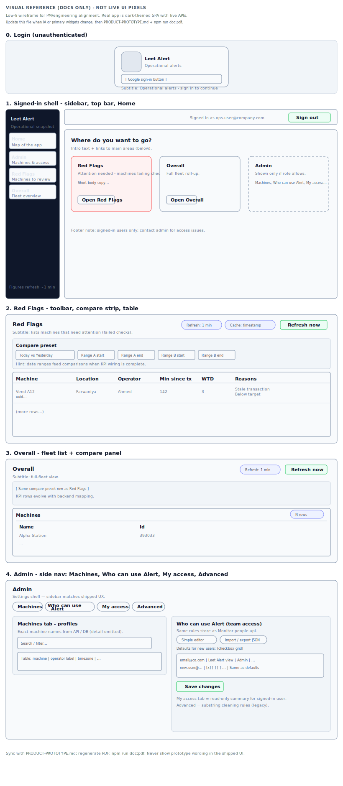

# Leet Alert — product scope (PM / PO)

**For stakeholders:** overview of routes, capabilities, and access. **Living app:** [alert.theleetclub.com](https://alert.theleetclub.com) (confirm ingress with engineering). **Repo:** `monitoring-app/apps/alert-theleetclub-com/`.

**Regenerate PDF:** from this folder, `npm run doc:pdf` (uses WSL/bash if needed). Commit `PRODUCT-PROTOTYPE.md`, `docs/product-prototype/visual-prototype.svg`, and `PRODUCT-PROTOTYPE.pdf` together.

**Note:** The shipped UI does not show “prototype” or lab wording; wireframes below are documentation only.

---

## Routes & capabilities

| Route | Area | What users get |
|-------|------|----------------|
| `/` | Entry | Sends signed-in users to **Home**. |
| `/login` | Login | Google sign-in only. |
| `/home` | Home | Hub: cards to Red Flags, Overall, and **Admin** (if role allows). |
| `/red-flags` | Red Flags | Machines failing checks; reasons; compare controls for future KPIs. |
| `/overall` | Overall | Full fleet list; compare strip; granularity grows with backend. |
| `/admin` | Admin | **Machines** (workbook Admin columns), **Who can use Alert** (org admins: Leet Alert vs full Monitor), **My access**, **Advanced** (substring cleaning). |

---

## Permissions (one line)

Same rules store as Monitor (**people-api**): **view** → Red Flags + Overall; **manage Leet Alert** → Admin (machines, own access summary); **org access admin** → edit **Who can use Alert** and optional full Monitor grid. No Leet Alert entitlements → **No access** after sign-in — an admin must grant access.

---

## Visual reference (wireframe)

Schematic SVG (not screenshots): login, shell + Home, Red Flags, Overall, Admin (sidebar sections + content sketch).

*Figures 0–4: Login; shell + Home destination cards; Red Flags; Overall; Admin.*

---

## PO quick facts

- **Refresh:** lists refetch about every minute; users can **Refresh now**.
- **Admin IA:** side nav **Machines → Who can use Alert → My access → Advanced** (team access tab only if org admin).

---

## Changelog

| Date (UTC) | Summary |
|------------|---------|
| 2026-05-02 | PO-focused PRODUCT doc; PDF pipeline embeds wireframe raster; Admin wireframe labels match side nav (**Who can use Alert**, order). |
| 2026-05-01 | Admin **Who can use Alert**: steps 1–3 (Leet Alert–only vs full Monitor); Machines vs xlsx Admin; tab subtitles. |
| 2026-04-30 | Home hub, sidebar hints; team access in Admin; operator copy on Red Flags / Overall. |
