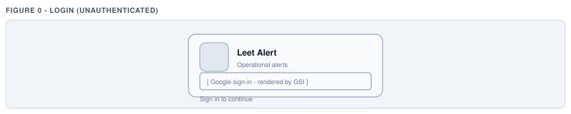
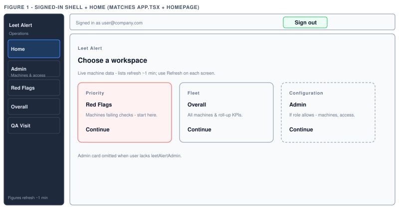
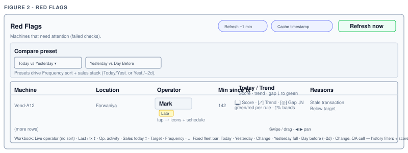
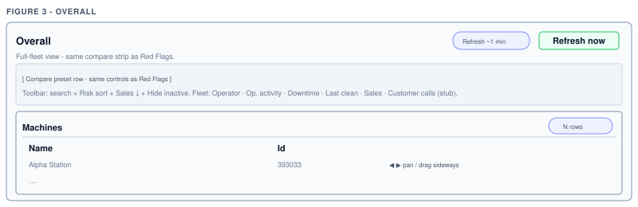
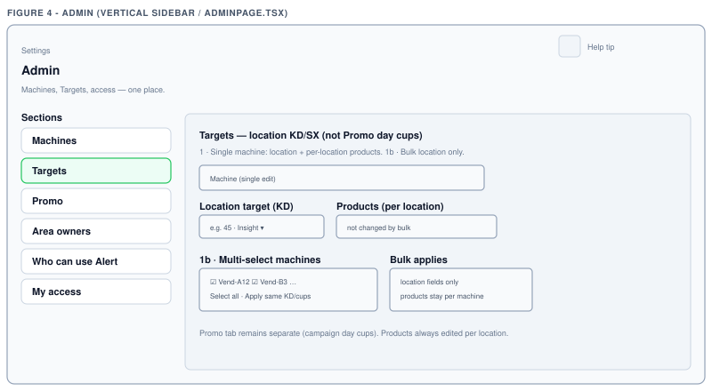

# Leet Alert — product scope (PM / PO)

**App:** [alert.theleetclub.com](https://alert.theleetclub.com) · **Repo:** `apps/alert-theleetclub-com/`  
**Refresh PDF:** `npm run doc:pdf` (commit md + `figures/wire-*.svg` + `PRODUCT-PROTOTYPE.pdf`).  
Shipped UI has no “prototype” wording — wireframes are documentation only.

---

## Routes & capabilities

| Route | Area | What users get |
|-------|------|----------------|
| `/` | Entry | Redirect to **Red Flags** (no Home tab). |
| `/login` | Login | Google sign-in. |
| `/red-flags` | Red Flags | Compare presets; table + cards; **Live operator** — Task Manager name in metric box + attendance badge (Late / Absent / Missing); column **not sortable**; **one tap** → schedule + **icon-only** contacts (no email/phone in table or modal body). **Last / tx** — weekday + date + time (3 lines; sortable via Vendon timestamp). Sales / Target / Trend / QA popups; fleet bar on Today vs Yesterday adds **Yesterday full day** + **Day before (−2d) full day** amounts + change %. Last clean + tech visit use snapshot/SafetyCulture. |
| `/overall` | Overall | Workbook columns; **sortable headers** (⇅/▼/▲) on all columns with real data; **Operator Activity** column; **Attendance** from Task Manager (`GET /api/alert/workflow/machine-attendance-map` + tap → `operator-schedule` modal); **Sales** uses `GET /api/alert/overall/daily-sales-elapsed` — **Today vs Yesterday** or **Yesterday vs Day Before** per compare preset; … |
| `/qa-visit` | QA Visit | **Standalone ops tab:** fleet overview with **date range** + **searchable machine dropdown** → machine workspace (filters carry over), KPI strip, trend, history, findings tabs, PDF. Separate from Red Flags cell popup. |
| `/admin` | Admin | User-entered data **not on Vendon** (schedules, cleaning, access). **Machines** (profiles, Vendon readout), **QA visit** (manual bullet summaries), **Who can use Alert**, **My access**, **Advanced**. |

---

## Permissions (summary)

**people-api** rules (same store as Monitor): view → Red Flags + Overall + **QA Visit**; **leetAlertAdmin** → Admin and edit **Who can use Alert** (same session rules API as Monitor **admin**); optional Monitor grid in **Advanced**. Adding people is limited to your Google Workspace domain(s): env **`ACCESS_ALLOWED_EMAIL_DOMAINS`** / **`DASHBOARD_ACCESS_EMAIL_DOMAINS`**, else the signed-in admin’s domain. No entitlements → **No access** after sign-in until an admin grants access.

---

## Visual UI prototype (figures 0–4)

Aligned with current React shell (`App.tsx`), Home (“Choose a workspace”), and Admin vertical sections (`AdminPage.tsx`).

*Figure 0 — Login*

*Figure 1 — Sidebar **Operations** (off-canvas **Menu** on phone + iPad / touch); desktop always shows icon rail or labeled sidebar (**Icons** / **Labels** toggle only — no full hide). Nav Home · Admin · Red Flags · Overall; Home hero + cards (Priority / Fleet / Configuration).*

*Figure 2 — Toolbar, compare preset, table.*

*Figure 3 — Same compare pattern; fleet table.*

*Figure 4 — Settings header; **Sections** sidebar (Machines active); Machines tab — machine picker, location owner datalist, Vendon tag.*

**Composite SVG (all panels):** `docs/product-prototype/visual-prototype.svg`

---

## PO quick facts

- Lists refetch ~**1 min**; **Refresh now** on each screen.
- Admin order: **Machines → Area owners → QA visit → Who can use Alert → My access → Advanced** (team tab only if org admin).

---

## Planned additions (roadmap)

**Full spec:** [`ALERT-ROADMAP.md`](ALERT-ROADMAP.md) (2026-06-17 PM intake).

| Area | Summary | Status |
|------|---------|--------|
| **QA column** | Last visit + **score chip**; **QA Visit tab** for full fleet/history/filters/trend/PDF; cell popup = full modal (unchanged) | **Shipped** — `/qa-visit` + `GET /api/alert/qa/machine-audits` |
| **Target column** | Beside sales: today % + remaining; popup WTD vs prior week | **Shipped** — snapshot `dailyTarget` + area-owner box + `GET /api/alert/targets/machine-detail` |
| **Cleaning 15h alert** | Overdue-not-cleaned notification + red-zone UI | **Shipped** — `cleaningOverdue15h` red row (table, cards, Overall); banner + optional browser notification; **alert icon** on Last clean opens **AI-style operator message preview** (Slack DM, Email, WhatsApp, Workflow Received — preview only) |
| **Sorting** | Sales today/month; QC latest/oldest | **Shipped** — Data columns sortable (⇅/▼/▲, third click clears); **Live operator** and other action-only columns excluded; **Last / tx** uses Vendon ISO timestamp |
| **Operator last access** | Last door open / machine access time | **Shipped** — **Operator Activity** column (`operatorLastAccessAt`); Live operator column = **name box + attendance badge only** (contacts in modal icons) |
| **Tech visit** | Leet Workflow last visit + comment popup | **Partial** — SafetyCulture fallback + Workflow scaffold (`GET /api/alert/workflow/tech-visit`) |
| **Leet Workflow — Attendance** | Task Manager schedule + punch status on Overall + Red Flags | **Shipped** — active schedule period → operator per machine; badge (Late yellow / Absent red / **Missing** when not scheduled); tap opens MTD modal (`operator-schedule`); fleet map fetched in **batches of 24** machine IDs |
| **Leet Workflow — other** | Cleaning, GO CHECK, Call OP DM, tech visit | **GO CHECK** sends Slack DM to scheduled operator (TM Received inbox API pending). Cleaning/Call OP still scaffolded. |

---

## Changelog

| Date (UTC) | Summary |
|------------|---------|
| 2026-07-13 | **Fleet revenue labels:** Secondary strip shows **Yesterday full day** KD, **Day before (−2d) full day** KD, and **Change (yest. vs −2d)** — mirrors primary/baseline/change so −2d amount is visible (was % only). |
| 2026-07-12 | **UI themes Classic / Pro v2:** Toggle in top bar + login (persisted). **Classic** = current tactical Stitch look. **Pro v2** = command-floor restyle (midnight steel, teal signal accents, Sora + IBM Plex Mono, glass top bar / fleet bar). Compare and pick; default remains Classic. |
| 2026-07-10 | **Fleet revenue — Yest. full day:** On Today vs Yesterday, the secondary strip compares **full yesterday vs full day-before (−2d)** from the revenue cache (not vs partial today). Label **vs −2d**. Main bar still uses same-elapsed today vs yesterday. |
| 2026-07-10 | **Sales Acceleration (SX):** New Red Flags column **SX** (Loc · Prod) — YoY-style lead pts + dual stack. Formula: growth = (cur−prev)/prev; SX = G_current − G_previous. Same compare presets as Sales. Admin: location daily KD target (overrides week default) + **SX product** name + **product cups/day** target. API: `GET /api/alert/overall/sales-acceleration`. |
| 2026-07-10 | **QA Visit sortable headers:** Fleet + inspection history use the same **⇅ / ▼ / ▲** column sort as Red Flags (click cycles desc → asc → clear). Sort dropdowns removed. |
| 2026-07-10 | **QA Visit tab polish:** Aligned filter bar + fleet/history tables. Machine search is a **searchable dropdown** (type to filter, pick to inspect / switch machine). |
| 2026-07-09 | **QA fleet dates — Red Flags fix:** `GET /api/alert/qa/summary` now includes **`latestByMachine`** (chunked SC scan + per-machine audit matching, same as machine workspace). Red Flags / Overall QA cells prefer this over stale `byLocationKey` rows (fixes Jan vs newer visit). Fleet endpoint uses the same matcher. |
| 2026-07-09 | **QA Visit fleet dates + latest fix:** Fleet tab shows **From/To** date filters (synced to machine drill-down). New `GET /api/alert/qa/fleet` returns latest SC visit per machine in range. Machine matching prefers **newest** visit, not stale exact-key row (fixes Jan vs June mismatch). |
| 2026-07-08 | **QA Visit tab:** New sidebar route **`/qa-visit`** — fleet overview + machine picker; full filters (dates, SC location, sort), week-vs-week trend, history table, findings, PDF. |
| 2026-07-08 | **QA history coverage + table pan:** Machine audit search walks **~monthly SafetyCulture windows** so older months can appear. Modal default range **1 year**. Trend chart restored. Fleet tables: **◀ ▶** + drag-to-pan. |
| 2026-07-08 | **QA visit popup — history + trend:** Wider modal with **inspection history table** (date / location / officer / score / PDF). Filters: **from–to dates**, location search, sort by date or score. **Week-vs-week score trend** sparkline (improving / declining / stable). Tap a row to load that audit’s findings + PDF. Carousel tabs scroll sideways on touch. |
| 2026-07-01 | **QC visits MTD = admin only:** Popup and cell badge count **Admin → QA visit** manual saves per machine (Kuwait month), not SafetyCulture inspection count. SC score/last visit/PDF unchanged. |
| 2026-06-28 | **GO CHECK — Slack DM:** Task Manager has no go-check write API; people-api sends **URGENT ACTION REQUIRED** to the scheduled operator via Slack DM (mailto fallback if Slack fails). |
| 2026-05-21 | **QA visit — SafetyCulture MTD + key findings:** Popup shows **QC visits MTD** (SafetyCulture audits in Kuwait calendar month). **Key findings** bullets: manual Admin summary first, else SC issue fields on latest audit, else AI/heuristic fallback. Cell shows MTD count badge when &gt;0. |
| 2026-07-01 | **Last clean — Task Manager daily checks:** people-api reads `GET /api/v1/daily-checks` (+ detail by id) per Postman **Daily checks** group. Popup shows Workflow upload time, **CC ✓** / **Pending CC** from `vm_review`, media links. Vendon snapshot still used when no daily check row exists. |
| 2026-06-30 | **Last clean popup:** Vendon snapshot timestamp only — removed internal “Workflow API not available” footnote when snapshot is shown. **CC ✓** / **Pending CC** still appear once Task Manager exposes cleaning uploads. |
| 2026-05-21 | **Last clean — Workflow CC status:** Cleaning popup prefers Workflow upload timestamp when API available; **CC ✓** (green) / **Pending CC** (red) pill when Command Center verification is returned. Comments + media links in popup. Until Workflow cleaning route ships, timestamp falls back to Vendon snapshot. |
| 2026-06-26 | **QA visit popup — monthly count:** Popup shows **Summaries this month** (Kuwait calendar month) with short description; count resets on the 1st. Admin tab unchanged. |
| 2026-06-26 | **QA visit — manual summaries:** Removed OpenAI bullet fetch from QA popup. New Admin tab **QA visit**: pick machine, enter bullet-formatted summary (validated); monthly save count per machine (Asia/Kuwait calendar month). Popup shows latest manual summary + SafetyCulture score/officer + PDF download. |
| 2026-06-13 | **QA visit score + AI summary + PDF:** QA column shows **score %** with green/amber/red chip. Popup: **3–5 bullet summary** from SafetyCulture report via **OpenAI** (`OPENAI_API_KEY` on people-api); **Download report (PDF)** proxied from SafetyCulture (no external SC link required). |
| 2026-06-24 | **Cleaning alert notifications (preview):** When last clean &gt; **15h** (`cleaningOverdue15h`), **alert icon** on Last clean opens modal with contextual operator message for **Slack DM**, **Email**, **WhatsApp**, and **Workflow Received** (preview/copy only — no send from Alert). |
| 2026-06-24 | **Red Flags polish — operator, Last TX, fleet bar, sales popup:** Live operator — name in metric box + Late/Absent/Missing badge (no email/phone in grid); modal contacts are **icons only**; no snapshot name flash before Task Manager load. **Last / tx** — 3-line date/time (no in-box label); sort uses Vendon timestamp. Sales today popup — **That day (same time)** shows **—** when prior-day data missing (not 0.000). Fleet revenue bar — **Yesterday overall** + vs-today trend on Today vs Yesterday preset. Backend: not_scheduled pill **Missing**. |
| 2026-06-23 | **Red Flags operator + modals + Last TX:** Operator cell uses Task Manager name fallback; **one combined modal** (contact + attendance). Cleaning/tech visit popups use snapshot + SafetyCulture instead of Task Manager stub errors. Last TX Vendon fallback window **7 days**. Modal click-through blocked (`useAlertModal` guard). |
| 2026-06-23 | **Task Manager attendance (Overall):** **Attendance** column uses Task Manager via people-api — batch `GET /api/alert/workflow/machine-attendance-map` (5 min refresh) and tap → `GET /api/alert/workflow/operator-schedule` modal (operator, today status, clock in/out, absent/late MTD). Requires **`LEET_WORKFLOW_API_BASE`** + **`leet-workflow-api-key`** secret on people-analytics-api. Upstream docs: `people-analytics-sync/docs/task-manager-api/`. |
| 2026-06-22 | **Fleet revenue bar + Last tx + yesterday preset:** Running total bar uses full period labels (Today / Yesterday, etc.), **Change** column label, taller bar. **Last / tx** column renders in bordered metric box (64px, matches sales/freq cells). **Yesterday vs day before** sales stack shows trend when baseline comes from Vendon fallback (elapsed 0/null) or only baseline is present. |
| 2026-06-21 | **Preset sales + fleet revenue bar:** All compare presets merge elapsed + Vendon sales (yesterday vs −2d, today vs LW with Kuwait date math). Fixed **LW all zero** when elapsed empty but cache has data. **Fixed bottom bar** — fleet revenue total, baseline, ▲/▼ trend follows selected preset (Red Flags + Overall). |
| 2026-06-21 | **Red Flags — Last tx + popups + Call AM:** **Last / tx** column fills from Vendon `/last-transactions` when snapshot ISO is empty (same fallback as Overall). Trend popup — single open path via `.freqTrendOpen` button; row retarget only when `click` lands on `<tr>` (fixes double-fire). **Call AM** without Slack shows muted `linkGo` box + tooltip (missing user ID or team). |
| 2026-06-21 | **YoY % + Sales today trend:** MTD YoY cell leads with large **% change** (green/red); KWD amounts secondary. Sales today box restores visible **↑/↓ trend %** (stronger size/weight in compact table CSS). |
| 2026-06-21 | **Last Transaction column restored:** Red Flags — dedicated **Last / tx** column (sortable; in All, Sales, Alerts presets); removed from Machine sub-line. Overall — **Last / tx** moved after Operator activity (Essential, Sales, Ops presets). |
| 2026-06-21 | **Popup fixes (iPad + trend + target owner):** Row tap uses capture-phase pointer target + synthetic click when Safari retargets to `<tr>` (Trend/Sales/Target/QA/cleaning/Call OP modals). Trend mini-card restores full ↑/↓ % visibility (no ellipsis clip). Target modal shows **full admin location owner** immediately (profile prefetch + API) with contact bar below. |
| 2026-06-21 | **Nav + sorting + modals + iPad taps:** Desktop sidebar always visible — **Icons / Labels** rail toggle only (full hide removed). **All valid table columns** sortable on Red Flags + Overall. Modals show row snapshot while API loads (target, cleaning, tech visit). **iPad/tablet:** pointerdown row guard + touch handlers so Trend, Sales, Target, QA, cleaning popups open reliably (no row detail stealing tap). |
| 2026-06-21 | **Target column + column composer:** Target **Left** KD no longer clips in table (wrap + wider box); tap opens full **WTD target modal** (`GET /api/alert/targets/machine-detail`) — daily target, today/yesterday %, remaining, WTD actual vs week target, prior-week trend, area owner contact. Column composer **expanded by default** on compact layouts; **Collapse** still available. |
| 2026-06-20 | **Ops surface system + column composer:** Unified inset cards (`ops-surfaces.css`) — KPI strip, compare bar, sales banner, column composer presets, alerts, machine cards share border/radius/background. Column composer in **opsToolStack** with compare. Interactive preset cards, bundle switches, column ribbon; per-user save via `/api/alert/me/ui-prefs`. |
| 2026-06-19 | **Operator Activity + sales sort:** Dedicated **Operator Activity** column (last WEB door open); **Sales today** and **Sales MTD** as separate sortable columns (high→low, toggle off on second click). Operator column = contact only. Red Flags + Overall. |
| 2026-06-19 | **PM roadmap completion:** Operator column shows **last WEB open** (relative) + email/phone; **Call OP** → `PersonContactModal`; **QA** sort (latest/oldest) + **sales** sort (today + MTD cycle); cleaning **15h** banner + browser alerts + red-zone on cards/Overall; Overall **QA** cell opens report popup. |
| 2026-06-18 | **Compare preset — Yesterday vs Day Before:** Red Flags **Frequency** trend/sort uses yesterday vs day-before incidents (`daily-incidents-elapsed`); Overall **Sales** stack shows Yest. vs −2d. **Leet Workflow scaffold:** proxy routes on people-api (`/api/alert/workflow/*`); Red Flags modals for operator attendance, GO CHECK task, cleaning detail, tech visit, Call OP DM; QA popup bullet summary. Requires **`LEET_WORKFLOW_API_BASE`** for live workflow data. |
| 2026-06-18 | **Red Flags regressions:** **Call OP** tap opens **PersonContactModal** (email, phone, Slack, WhatsApp) with grey icon slots when data missing; **QA** SafetyCulture cache processes more audits, EU report links, improved QC/template matching; operator contact API enriches phone/WhatsApp from Vendon. |
| 2026-06-13 | **Red Flags — roadmap slice:** **Target** column (today % + remaining, WTD modal); **QA visit** column (SafetyCulture, tap for report); **operator last access** under live ops name; **cleaning >15h** row highlight; **sales today** column sort. APIs: `operatorLastAccessAt` / `dailyTarget` / `cleaningOverdue15h` on snapshot; `GET /api/alert/qa/summary`, `GET /api/alert/targets/machine-detail`. |
| 2026-06-17 | **Roadmap intake:** QA column (SafetyCulture parity), Target column (WTD + progress bars), cleaning 15h alerts, column sorting, operator last-access timestamp, QC report popup — see [`ALERT-ROADMAP.md`](ALERT-ROADMAP.md). |
| 2026-06-17 | **Red Flags — Operator column:** Shows **live ops name only** (click for email, phone, Slack, WhatsApp). **Cleaning schedule label** (e.g. “half cleaning”) appears on a separate muted line with tooltip — it is the Admin cleaning-rule name, not a second person. Fixed **strike email** resolution (`operatorEmail` vs `strikeOperatorEmail` API mismatch) so Call OP and contact modals populate. |
| 2026-06-13 | **Column help:** Header labels are the help target — hover (PC) or tap (iPad) opens the popover; no visible **?** icon. **`th` `title`** kept as fallback. **Red Flags — Trend history:** Tap the **Trend** mini-card opens **today vs prior days** (same elapsed Kuwait clock) with trend %; respects compare preset (calendar days, same weekday chain, or WTD baselines). API: `GET /api/alert/red-flags/daily-incidents-elapsed`. |
| 2026-06-10 | **Table headers:** Two-line grid (main + sub) so Red Flags / Overall column titles align consistently. **Overall — Peak hour:** From Vendon daily revenue cache (Kuwait busiest hour + vend count); API seeds today’s cache on first load. |
| 2026-06-10 | **Overall — Sales history popup:** Tap sales opens **today vs each prior day** (same elapsed Kuwait clock) — today vs yesterday, today vs 2 days ago, etc., each with trend %; table cell still shows today vs yesterday stack. |
| 2026-06-11 | **Adaptive ops layouts:** Red Flags **Cards** view on iPad (toggle to Table). Overall **Essential** columns on iPad (8 cols) + **All columns** toggle. Overall table typography aligned with Red Flags (`opsFleetTable`). Sticky machine column on horizontal scroll. |
| 2026-06-11 | **iPad / touch UX:** Nav drawer on all viewports ≤1366px **and** touch-first devices (fixes sidebar stuck open on some iPads). Column help via tap **?** (`InfoTip`) instead of hover-only tooltips. **Red Flags row detail** — structured sheet (why flagged, sales, credits, frequency, people, Go check). Larger tablet typography. |
| 2026-06-10 | **API fix:** `alert_routes` cache used `datetime.time` instead of `time.monotonic()` — broke remote-credits, daily-sales, and caused 503s. **Stitch v2** export applied (tactical tokens, table panel headers). |
| 2026-06-10 | **Red Flags / Overall dashboards:** Unified Stitch ops panel — KPI strip, compact controls, responsive table scroll, inline SVG nav icons (CSP-safe). Replaces mixed legacy cards on Overall. |
| 2026-06-10 | **Stitch design system:** Applied Google Stitch export (`docs/stitch-export/`) — Inter + Space Mono, Dark Ops tokens, icon sidebar, Kuwait clock top bar, table headers. Real data/API unchanged. |
| 2026-06-10 | **iPad / tablet layout:** Drawer nav only on **phones (≤767px)** — iPad portrait keeps fixed sidebar. Safe-area padding, **44px** touch targets, tablet typography on Red Flags / Overall tables (768–1194px). |
| 2026-06-10 | **Auth / session:** Ingress routes **`/api`** on `alert.theleetclub.com` to people-api (first-party cookies, same as Monitor v2). SPA waits for **`/api/me`** before showing login; Google **auto_select** when session expired but Google account active. |
| 2026-06-10 | **Responsive shell:** Sidebar **auto-hides** on **phones** (≤767px) — **Menu** in top bar opens off-canvas nav + backdrop; iPad and desktop keep fixed sidebar. **Red Flags / Overall tables:** Short uppercase headers (full text in tooltips), **horizontal scroll** instead of vertical letter-wrapping. **Overall — Sales:** `GET /api/alert/overall/daily-sales-elapsed` — today KWD through page load vs yesterday same clock window (Kuwait). |
| 2026-05-08 | **Red Flags — Vendon KPI columns:** **Send credit** (remote credits sent today): ≤5 green · ≤10 orange · &gt;10 red. **Test credits** (dispense tests): ≤6 green · &gt;6 red. **Vends resolved:** last failed vend today vs nearest remote credit — ≤5 min green · &gt;5 min red · no fail green · unknown grey (`people-api` `compute_vends_resolved_for_machine` + optional `machines` on `today-totals`). **Last cleaning:** snapshot time + Admin **cleaning windows** — on schedule green · outside orange · no cleaning today red (shared `kuwaitCleaningStatus` with Overall). |
| 2026-05-08 | **Admin — Machines layout:** **`adminCardMachineProfile`** — Core **`repeat(3, minmax(12rem,1fr))`** + **`min-height: 40px`** on selects/inputs so labels line up and dropdown text does not clip; **Operating days** in **`adminOperatingDaysBlock`** (caption row + radios); **Remove** on cleaning/operator/staff hour rows uses **`adminTimePairActionCell`** + invisible **`adminFieldCaptionSpacer`** so the button lines up with time inputs; technician intro shortened to one line. |
| 2026-05-08 | **Overall — People Count / Footfall:** `GET /api/alert/overall/people-footfall` sums `people_in` (daily Videoloft buckets) from `people_analytics_records` for Kuwait **today vs yesterday**; resolves cameras with the same embedded map as Monitor v1 `peopleCameraToMachineMap`, optional `alert_people_camera_map.json` / `ALERT_PEOPLE_CAMERA_MAP_JSON`, cached Videoloft device list, optional `ALERT_PEOPLE_FUZZY_MATCH`. |
| 2026-05-07 | **Overall:** No **Fleet table** subheading (count badge only). **Compact column headers** (short label + full title/note on hover), tighter spacing. **Admin · Location hours** + snapshot columns + Vendon fallback as before. |
| 2026-05-07 | **Red Flags — Today / Trend:** Three icon boxes — **Score** & **Gap** values use **green** at zero burden and **tiered red** by incident count; **Trend** uses Δ% with **tiered red** on bad uptrends. **Gap** shows **`↓0`** (at green) or **`↓N`** (must **drop** N incidents to reach green); **`—`** if unknown. Header subcopy **gap ↓ to green**. Tooltips spell out direction vs baseline. |
| 2026-05-07 | **Tables — text overflow:** Removed global `nowrap` on desktop table cells; **`overflow-wrap` / `word-break`** on all `th`/`td` so long machine names, emails, and alert text wrap inside cells instead of spilling past the table. Red Flags frequency mini-cards allow trend/ratio lines to wrap when narrow. Optional utility **`.tableCellNoWrap`** for rare single-line metrics. |
| 2026-05-07 | **Responsive UI:** Sidebar collapses to a **top horizontal nav** on mobile/tablet; page containers widened on desktop (`pageShell` / `pageShellWide`). Tables now wrap on small screens (less forced horizontal scroll), with tighter cell padding + fonts under 900px/720px. |
| 2026-05-07 | **Red Flags — Frequency column:** Wider column reserved on the table (**~14rem** min) so three mini-cards keep **readable type** (clamp up to v1 ~11px counts / 9px trends); **card height** restored (~46px). Badges can wrap to two lines (**VEND FAIL**). |
| 2026-05-07 | **Red Flags — Frequency column:** Restored **Monitor v1** layout — three compact mini-cards (**STALE** · **OFF** · **VEND FAIL**): baseline count on top (e.g. `8/13`), **trend %** under an inner divider (↑ red / ↓ green / flat grey). Header title **Frequency** + per-mode subtitle. Cells sized tighter than legacy defaults for fit. |
| 2026-05-06 | **Red Flags:** **Call OP** / **Call AM** columns (Slack DM when `SLACK_*` ids configured; AM resolved from AM Plan location buckets; OP uses strike email → optional Slack user map, else mailto). Placeholder KPI columns show **?**. **Overall:** **?** + hover for disconnected metrics. **Admin:** catalog vs saved profile counts at top. |
| 2026-05-06 | **Red Flags board:** “Send Credit” → **Credits Sent** + new **Dispense Tests** (same criteria as Monitor drink tests). Earlier experiment: Score / Trend / Gap triplet — **superseded** by per-case Frequency mini-cards aligned with Monitor v1. **Overall:** Operating Hours now shows **hours only** (tag displayed separately) and Admin “Saved profiles” moved below the editor. |
| 2026-05-06 | **Fleet tags:** API adds `vendon_tag_source`; Admin explains **how the tag was derived** (feed field / group / name parse). **Removed** sidebar **Documentation map** + Red Flags **xlsx/docs** UI copy. **Machines / Advanced** tables: **bounded scroll**, sticky header, wrapped cells. Prior Admin machine-profile row editor + machine tag column behavior unchanged. |
| 2026-05-05 | **Admin → Location owner:** Vendon **`prose` / `callInCode`**, **split machine `name`** on `\| / –` for fleet codes; no **`/location`** names in tag datalist; API validates tags only; UI **does not prefill** legacy DB site text — hint when Vendon has no tag. |
| 2026-05-02 | **Who can use Alert** — org email domain allowlist (server + UI); **leetAlertAdmin** can save access rules. Red Alert / machine **location** text prefers Vendon **tags** and machine tag fields before the generic Vendon `location` string (aligns with Admin “location owner” / machine tag). |
| 2026-05-04 | **Red Flags** = **xlsx** column order (through **Tech Visit**); `alert.theleetclub.com.xlsx` in repo; `redFlagsWorkbookColumns.ts`; placeholders for columns not in snapshot; machine / alert split; **Admin** tag/priority (other row). |
| 2026-05-02 | **Timespan presets** (Today VS Yesterday default, +4) on Red Flags & Overall; Admin = data not on Vendon; five **figure SVGs** + PDF; Red Flags = Monitor Red Alert style. |
| 2026-05-01 | **Who can use Alert** steps; Machines vs workbook Admin; PO doc + PDF raster. |
| 2026-04-30 | Home hub; team access in Admin. |
